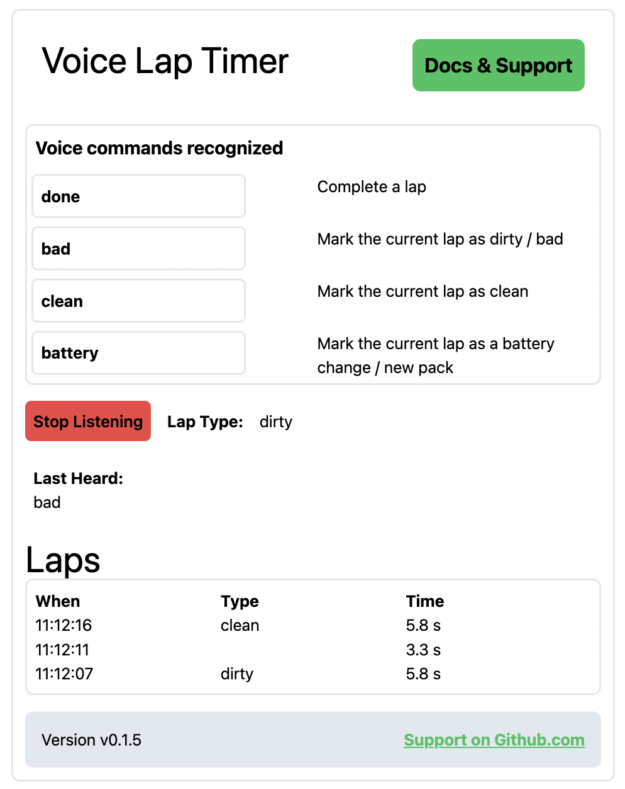

# voice-lap-timer Support
Support for [http://voice-lap-timer.vercel.app](http://voice-lap-timer.vercel.app).

Questions or suggestions? Please open a request in [issues](https://github.com/kdorff/voice-lap-timer-support/issues).

# voice-lap-timer

Visit [http://voice-lap-timer.vercel.app](http://voice-lap-timer.vercel.app) to use **voice-lap-timer**.

Once the app is running, click . It will then recognize the commands as documented on the page.

# Commands In short
Every time you cross the "Start Gate" say the **Complete a lap** word, which defaults to `done`. At time you complete a lap, `voice-lap-timer` will speak the most recent lap time.

During a lap you can say **bad**, **clean**, or **battery** and it will mark that lap with this specified type.

- **bad** suggests you made a mistake during the lap.
- **clean** suggests you felt the lap went well.
- **battery** suggests changed the battery / installed a new pack during the lap.

You can change the voice commands to use words that work best for you. The updated commands should be rememberd between sessions using browser "local storage."

# How to support the author

This app currently free to use. But it takes time and effort to write and maintain. Click the **Buy me a coffee** link to help support my work.

# Version history

| Date       | Version | Change                                  |
| ---------- | ------- | --------------------------------------- |
| 2024-04-23 | v0.1.7  | Better force of light mode. Formatting. |
| 2024-04-19 | v0.1.6  | Better non-compat page. Update readme.  |
| 2024-04-19 | v0.1.5  | Link to support.                        |
| 2024-04-18 | v0.1.4  | Button text. Add version number.        |
| 2024-04-17 | v0.1.3  | Add vercel analytics.                   |
| 2024-04-16 | v0.1.2  | BMC link.                               |
| 2024-04-16 | v0.1.1  | Change defualt commands. Formatting.    |
| 2024-04-15 | v0.1.0  | Report times with one demcial point     |
| 2024-04-14 |         | Change sound effects library            |
| 2024-04-14 |         | Lowercase what was heard for accuracy   |
| 2024-04-13 |         | Use signals instead of state            |
| 2024-04-11 |         | Store custom commands in local strage   |
| 2024-04-04 |         | Add icon                                |

# Browser Compatibility

- **This code only works Chrome-based browsers**.
- Chrome on Mac is my daily driver and will be the best tested.
- I've tested with Chrome and Safari on Mac.
- I've tested with Chrome on Windows.
- Chrome on Anroid (on my current Pixel phone) stops listening after one command. Colors are wrong on all mobile.
- Chrome on iPad works but the spoken lap time is stuttery. Colors are wrong on all mobile.
- Safari on iPad works but the spoken lap time is stuttery. Colors are wrong on all mobile.

Learn more at [Web_Speech_API browser compatibility](https://developer.mozilla.org/en-US/docs/Web/API/Web_Speech_API#browser_compatibility).

# Is the source code available?

At this time, [voice-lap-timer](http://voice-lap-timer.vercel.app) is closed source. Feel free to contact me with questions.
