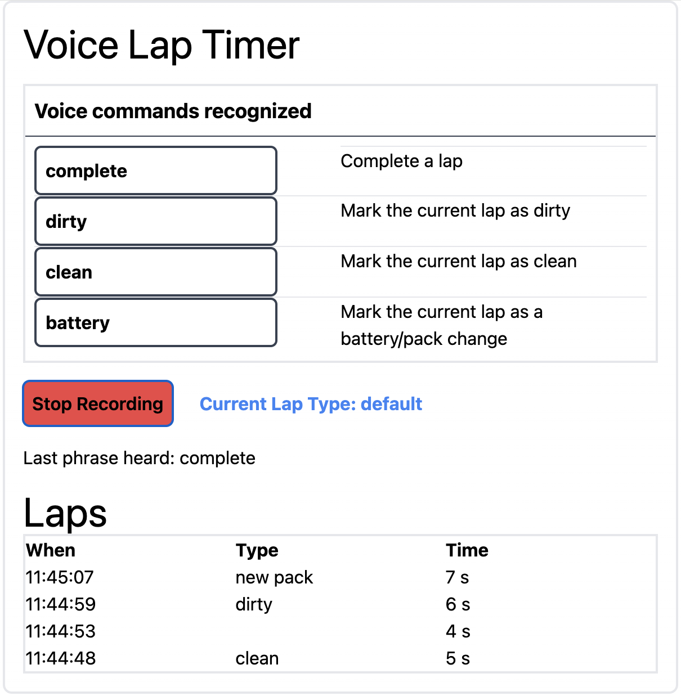

# voice-lap-timer Support
Support for [http://voice-lap-timer.vercel.app](http://voice-lap-timer.vercel.app).

Questions or suggestions? Please open a request in [issues](https://github.com/kdorff/voice-lap-timer-support/issues).

# voice-lap-timer

Visit [http://voice-lap-timer.vercel.app](http://voice-lap-timer.vercel.app) to use **voice-lap-timer**.

Once the app is running, click . It will then recognize the commands as documented on the page.

# Commands In short
Every time you cross the "Start Gate" say the word "done". At that point, it will tell you how long the previous lap took.

During a lap you can say **bad**, **clean**, or **battery** and it will mark that lap with this specified type.

- **bad** suggests you made a mistake during the lap.
- **clean** suggests you felt the lap went well.
- **battery** suggests changed the battery / installed a new pack during the lap.

You can change the voice commands to use words that work best for you. The updated commands should be rememberd between sessions using browser "local storage."

# How to support the author

This app currently free to use. But it takes time and effort to write and maintain.

# Version history

| Date       | Version | Change                                |
| ---------- | ------- | ------------------------------------- |
| 2024-04-18 | v0.1.4  | Button text. Add version              |
| 2024-04-17 | v0.1.3  | Add vercel analytics.                 |
| 2024-04-16 | v0.1.2  | BMC link.                             |
| 2024-04-16 | v0.1.1  | Change defualt commands. Formatting.  |
| 2024-04-15 | v0.1.0  | Report times with one demcial point   |
| 2024-04-14 |         | Change sound effects library          |
| 2024-04-14 |         | Lowercase what was heard for accuracy |
| 2024-04-13 |         | Use signals instead of state          |
| 2024-04-11 |         | Store custom commands in local strage |
| 2024-04-04 |         | Add icon                              |

# Browser Support

**This code currently only works Chrome-based browsers**. See the discussion about supported browsers within [react-speech-recognition-es's README.md](https://github.com/tianjianchn/react-speech-recognition) to learn about using this with other browsers.

# Is the source code available?

At this time, [voice-lap-timer](http://voice-lap-timer.vercel.app) is closed source.
